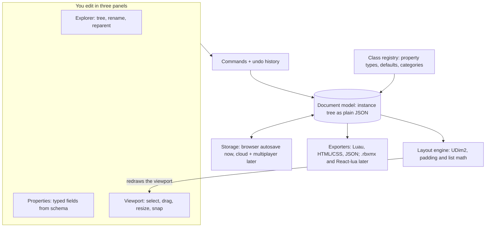

# Studio-Style UI Builder: Plan v0.1

As of 2026-10-04. Exported from the live plan doc (a Claude Doc owned by Armin), with the two drawings redrawn as Mermaid.

## TL;DR

We build a browser app where you make UI exactly the way Roblox Studio does it: insert Frames, TextLabels and buttons, arrange them in an Explorer tree, tune them in a Properties panel, and place everything with Scale + Offset. Working name: **Framecraft** (a placeholder until we pick a real one).

Recommendation: keep the Studio-style editor and ship both exporters, but lead with web output. At least five browser tools already export Roblox UI, while we found nobody offering Studio's way of building for the web. The editor core is identical either way, so a one-week test with real users can settle it.

What exists today: this plan and a clickable prototype of the editor (in `prototype/`) with an Explorer, a Properties panel, drag and resize with smart snapping, device presets, undo/redo, and export to Luau, HTML and JSON. The next step is putting it in front of 10 creators per audience, as the Roadmap describes.

## Who it's for, and the first big decision

Build for people who already know Roblox Studio: they think in Frames, Scale and Offset, so there is nothing new to learn. The open question is which output we lead with.

| Audience | What they need | Why this tool |
| --- | --- | --- |
| Roblox UI designers and commission builders | Design faster, share with clients, hand off clean UI | Real Roblox objects instead of a Figma translation; paste-ready Luau |
| Creators on Chromebooks, iPads and school laptops | A way to build UI at all: [Roblox Studio](https://create.roblox.com/docs/education/resources/frequently-asked-questions-education) runs only on PC and Mac | Runs in any browser; export when they get to a PC |
| Web makers who learned on Roblox | A web builder that works like the tool they already know | Same model, exports HTML/CSS |

Both exporters are small, so the decision is about audience and positioning, not engineering.

| | Roblox-first | Web-first |
| --- | --- | --- |
| Output | Luau script, later a .rbxmx model file | HTML/CSS, later React |
| How we prove it works | Paste into Studio and compare | Open it in a browser |
| Competition | Crowded: free browser builders like [BuildGUI](https://buildgui.com/) and [Roblox GUI Maker](https://github.com/bruce-hmz/roblox-gui-maker), the paid [Avenlo](https://devforum.roblox.com/t/avenlo-browser-based-ui-ui-animation-with-keyframe-editor/4703395), and Figma converters like [FigBloxUI](https://devforum.roblox.com/t/figbloxui-%E2%80%94-figma-to-roblox-ui-in-seconds/4446977) | No tool we found builds web UI the Studio way; general builders like Webflow and Framer are the alternative |
| Fit with the Studio model | Native: this is how Roblox UI already works | Great for fixed screens (app screens, game HUDs, stream overlays); long pages need a ScrollingFrame |
| Demand evidence | Strong: at least three new tools announced on the DevForum in 2026 alone | Unproven: needs testing |
| Where to find users | Roblox DevForum, Discord servers, YouTube tutorials | The same Roblox channels, pitched as "you already know how to build UI" |

**Recommendation:** lead with web output, keep Roblox export as the on-ramp. "A free browser GUI maker for Roblox" already exists several times over, so it can't be our edge; "build web UI the way Studio does" has no direct competitor and matches the original idea. Re-check this after showing the prototype to ten people from each audience.

## The Studio mental model we're copying

Everything is an object in a tree, every object has properties, and every position is Scale + Offset relative to the parent. We copy those three ideas exactly, so a Studio user feels at home in the first minute.

- **Explorer tree.** A ScreenGui holds Frames, TextLabels, buttons and images, and children move with their parent ([UI objects](https://create.roblox.com/docs/ui)).
- **Properties panel.** Objects are edited by typing values. Studio accepts shorthand like `0.25,40,0.1,20`, or a single `0.5` meaning 50% on both axes; we accept the same ([position and size](https://create.roblox.com/docs/ui/position-and-size)).
- **Scale + Offset (UDim2).** Scale is a fraction of the parent's size, Offset is pixels, and the two add up. AnchorPoint picks which point of the object sits at its Position.
- **Modifiers are child objects.** Corners, outlines, gradients, padding and drop shadows are separate children (UICorner, UIStroke, UIGradient, UIPadding, UIShadow), not style fields ([appearance modifiers](https://create.roblox.com/docs/ui/appearance-modifiers)).
- **Layouts take over.** A UIListLayout or UIGridLayout child overrides the Position of its siblings.
- **Layering.** By default children draw above their parent, and ZIndex orders siblings.

The whole layout engine is one formula, applied per axis:

```
AbsSize = ParentSize * Size.Scale + Size.Offset
AbsPos  = ParentPos + ParentSize * Position.Scale + Position.Offset - AnchorPoint * AbsSize
```

UIPadding shrinks ParentSize before the formula runs, and layouts replace Position entirely. Roblox keeps extending this model with flex layouts and CSS-like styling, so our data model must leave room for both.

Where we can beat Studio:

- **Both units, always visible.** Show Scale and Offset while dragging, plus one-click "convert to Scale" for a whole tree.
- **Live code view.** The Luau updates as you drag, which also teaches scripting.
- **Side-by-side devices.** Phone, tablet and desktop at once instead of switching back and forth.
- **Share a link.** Clients and teammates view and comment without installing anything.
- **Starter templates.** Shop, inventory, settings and HUD layouts to remix.

## MVP scope

The MVP lets someone build a typical game menu or app screen (panel, title, a list of buttons, a coin counter) and export it as a web page and as Luau for Studio, looking the same in both. Everything else waits.

| Area | In v0.1 | Later |
| --- | --- | --- |
| Containers | ScreenGui | SurfaceGui, BillboardGui |
| Objects | Frame, TextLabel, TextButton, TextBox, ImageLabel, ImageButton, ScrollingFrame | CanvasGroup, ViewportFrame, VideoFrame |
| Modifiers | UICorner, UIStroke, UIGradient, UIPadding, UIAspectRatioConstraint | UIShadow, UISizeConstraint, UITextSizeConstraint, per-corner radii |
| Layouts | UIListLayout (direction, alignment, padding, sort order) | Flex (UIFlexItem, Wraps), UIGridLayout, UIPageLayout |
| Editing | Select, drag, 8-handle resize, smart snapping, nudge, copy/paste, duplicate, delete, undo/redo, drag-to-reparent in the Explorer | Multi-select, align and distribute, lock, marquee select |
| Properties | Typed fields for UDim2, Vector2, Color3, enums, numbers and text, with Studio's shorthand; convert to Scale or Offset | Editing many objects at once |
| Preview | Device presets, zoom, a live preview mode with button hover | Side-by-side devices, safe-area overlay |
| Output | Luau script, HTML/CSS page, JSON project file | .rbxmx model file, React-lua and Fusion code, a Studio sync plugin |
| Saving | Autosave in the browser, JSON import and export | Accounts, cloud projects, share links, version history |

Out of scope for v0.1: scripting beyond button hover, animations, real-time collaboration, uploading images to Roblox, StyleSheets, accounts and payments. Images use an uploaded preview in the editor and keep their `rbxassetid` for export.

## How Roblox UI maps to the web

Most of Roblox's layout maps one-to-one onto CSS, which is why the editor can render in the browser and export both ways. Rounded corners, scaled text and aspect ratios are the only parts that need a little extra work.

| Roblox | Web equivalent | Fidelity |
| --- | --- | --- |
| ScreenGui | A fixed full-window layer (`position: fixed; inset: 0`) | Exact; we export with `IgnoreGuiInset` on so both sides agree on the screen area |
| Position (UDim2) | `left`/`top: calc(Scale × 100% + Offset px)` | Exact |
| Size (UDim2) | `width`/`height: calc(Scale × 100% + Offset px)` | Exact |
| AnchorPoint | `transform: translate(−X × 100%, −Y × 100%)` | Exact |
| Rotation | `rotate()` around the center | Exact |
| ZIndex (default Sibling mode) | `z-index` among siblings; children draw above parents | Exact |
| ClipsDescendants, Visible | `overflow: hidden`, `display: none` | Exact |
| BackgroundTransparency | The alpha in `rgba()`, equal to 1 − transparency | Exact |
| UICorner | `border-radius`; Scale is measured on the shortest side, so 0.5 makes a pill | Needs the element's size: container units or a small script |
| UIStroke on a frame | `box-shadow: 0 0 0 T px` (outside the box, follows corners) | Close |
| UIStroke on text | A text outline (`text-shadow` or `-webkit-text-stroke`) | Approximate |
| UIGradient | `linear-gradient()` multiplied with the background color; transparency through `mask-image` | Close for Linear; Radial and Conical later |
| UIPadding | An inner content box inset by the padding | Exact; plain CSS `padding` would not move absolutely positioned children |
| UIListLayout | Flexbox: `flex-direction`, `gap`, `justify-content`, `align-items` | Exact for non-flex lists |
| UIGridLayout | CSS Grid | Later |
| UIAspectRatioConstraint | Computed size that fits the ratio inside the box | Needs container units or a script; CSS `aspect-ratio` alone ignores it when both sides are set |
| TextScaled | Fit-to-box text, computed by a small script | Close |
| Fonts (Enum.Font) | Google Fonts look-alikes, such as Montserrat for Gotham | Approximate; Roblox's own font files can't ship on the web |

## Architecture

One plain-JSON document is the single source of truth; everything else is a view of it or a function of it.



Panels never move pixels themselves: they send commands to the document, and the layout engine and exporters read from it, so the canvas, the Luau and the HTML can't disagree.

| Layer | Choice | Why |
| --- | --- | --- |
| Language | TypeScript | The class registry and property types catch mistakes before users do |
| Panels | React (or Svelte) | Explorer and Properties are ordinary forms and trees |
| Canvas | Plain DOM elements placed by our own layout engine | Real text and fonts, and the same output as the HTML export |
| State and undo | One store (such as Zustand) plus a command list | Undo/redo and later multiplayer both need edits as discrete steps |
| Tests | Vitest for layout math and exporters; Playwright for drag and resize | The UDim2 formula and exporters are pure functions, easy to test |
| Hosting | A static site on Vercel, Netlify or Cloudflare Pages | No server until accounts exist |
| Later | Yjs for multiplayer; Supabase for sign-in and cloud projects | Both drop in without changing the document model |

## Landscape

Roblox output is a crowded lane: in 2026 alone the DevForum saw a Figma converter (February), a Studio plugin (April) and a browser editor (June), next to several free web builders. None of them builds for the web, and none offers real-time editing together.

| Tool | What it is | Price | Where it stops |
| --- | --- | --- | --- |
| [Roblox Studio](https://create.roblox.com/docs/ui) | Roblox's own editor: Explorer, Properties, Style Editor | Free | Windows and Mac only; plugin authors call its UI editing clumsy (no zoom, weak snapping) |
| [Sketch](https://devforum.roblox.com/t/plugin-sketch-a-figma-like-ui-editor-for-roblox-studio-v177/4570888) | Figma-like canvas plugin inside Studio with live sync | Free; a paid Pro is planned | Needs Studio; no team editing |
| [Avenlo](https://devforum.roblox.com/t/avenlo-browser-based-ui-ui-animation-with-keyframe-editor/4703395) | Browser editor for Roblox UI files: imports .rbxm/.rbxmx, device previews, animation, Studio sync | Paid after a 3-day trial ($5/month at launch, then one-time packages) | Roblox output only |
| [BuildGUI](https://buildgui.com/) | AI prompt to editable Roblox GUI, templates, Studio transfer plugin | Free to explore; .rbxmx export and AI generation need Pro or sign-in | Roblox output only; built around templates |
| [Roblox GUI Maker](https://github.com/bruce-hmz/roblox-gui-maker) | Open-source drag-and-drop builder that exports Luau | Free | Roblox output only; no .rbxmx yet |
| [FigBloxUI](https://devforum.roblox.com/t/figbloxui-%E2%80%94-figma-to-roblox-ui-in-seconds/4446977) and other Figma converters | Design in Figma, convert to Roblox objects, images uploaded for you | $5/month or $30/year after a 14-day trial | Requires Figma; components and variants are lost |
| Webflow, Framer | General web builders | Free tiers, paid plans | CSS box model; nothing like Studio's way of working |

Takeaway: "free" and "in the browser" are table stakes. Our edges are web output for Studio-trained creators, a live code view that teaches, and later multiplayer editing.

## Roadmap

Ten weeks from prototype to public beta, with the first big decision after week 2. Weeks assume about 10 hours a week.

| Phase | When | What | Gate at the end |
| --- | --- | --- | --- |
| Prototype | Now (Oct 2026) | Clickable editor, Luau and HTML export | |
| User tests | Weeks 1 to 2 | 10 creators per audience try it | **Pick the lead output**: 5 of 10 testers come back |
| Real codebase | Weeks 3 to 6 | TypeScript repo, tests, panels, exporters | |
| Public beta | Weeks 7 to 10 | Templates, share links, polish | **Launch publicly**: 10 reference screens match Studio |
| Grow | After the beta | Accounts, cloud, multiplayer, .rbxmx export | |

The first gate matters most: it decides whether the web export or the Roblox export gets the polish.

First week:

- [ ] Rebuild one menu from a game you like in the prototype
- [ ] Export it as Luau, paste it into Studio's command bar, and compare the two side by side
- [ ] Export it as HTML and open it at a few window sizes
- [ ] Write down five things that felt slow or wrong
- [ ] Find 10 testers per audience (Roblox Discord servers, the DevForum, friends) and ask each: what would you build with this, and what's missing?
- [ ] Pick a real name and check the domain
- [ ] Start the repo (Vite + TypeScript) and move the layout math into its own tested module

## Risks and open questions

The biggest risk is building one more Roblox GUI maker nobody switches to. The first round of user tests exists to prevent that.

| Risk | Why it matters | Mitigation |
| --- | --- | --- |
| Demand for web output is unproven | An empty lane can mean nobody wants it | Test the prototype with 10 creators per audience before building more |
| Rendering drift from Studio | Browser text and fonts differ slightly from Roblox's, and users notice | Treat Studio as the source of truth; compare a set of reference screens before each release |
| Roblox keeps adding UI features | UIShadow, flex and StyleSheets all arrived recently | A schema-driven property registry, so new properties are data instead of new code |
| Fonts | Gotham and Builder Sans can't ship on the web | Look-alike Google Fonts in the editor; exact `Enum.Font` names in the Luau export |
| Images | `rbxassetid` images can't be shown in a browser without Roblox's APIs | Preview from an uploaded picture and keep the asset ID for export; optional Roblox sign-in later |
| Trademark and trust | Roblox's name or logo can make us look official | Original name and branding, a "not affiliated with Roblox" line, no Roblox logo |
| Young users | Many Roblox creators are under 18 | No accounts in the MVP and no personal data; check children's privacy rules (COPPA, GDPR) before adding accounts |

Open questions:

- [ ] Web-first or Roblox-first, decided after the user tests
- [ ] A real product name (Framecraft is a placeholder), with a free domain
- [ ] Free forever, or a paid tier for collaboration and cloud projects
- [ ] Open-source the editor core or keep it closed
- [ ] Who builds it with you, if anyone

## Sources

- [Roblox Creator Hub: Frequently asked questions (education)](https://create.roblox.com/docs/education/resources/frequently-asked-questions-education)
- [Roblox Creator Hub: User interface](https://create.roblox.com/docs/ui)
- [Roblox Creator Hub: Position and size UI objects](https://create.roblox.com/docs/ui/position-and-size)
- [Roblox Creator Hub: UI appearance modifiers](https://create.roblox.com/docs/ui/appearance-modifiers)
- [DevForum: Avenlo, browser-based UI editor (June 2026)](https://devforum.roblox.com/t/avenlo-browser-based-ui-ui-animation-with-keyframe-editor/4703395)
- [DevForum: FigBloxUI, Figma to Roblox (February 2026)](https://devforum.roblox.com/t/figbloxui-%E2%80%94-figma-to-roblox-ui-in-seconds/4446977)
- [DevForum: Sketch, Figma-like UI editor plugin (April 2026)](https://devforum.roblox.com/t/plugin-sketch-a-figma-like-ui-editor-for-roblox-studio-v177/4570888)
- [BuildGUI](https://buildgui.com/)
- [Roblox GUI Maker on GitHub](https://github.com/bruce-hmz/roblox-gui-maker)
